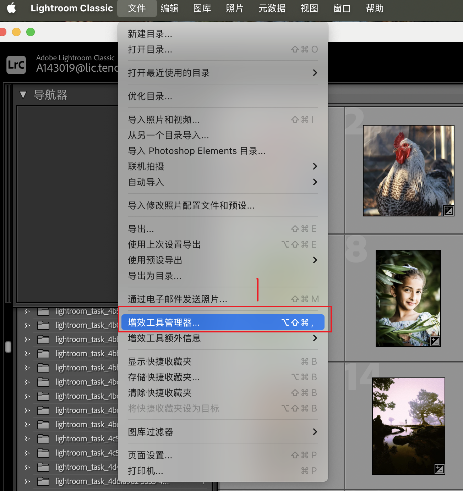
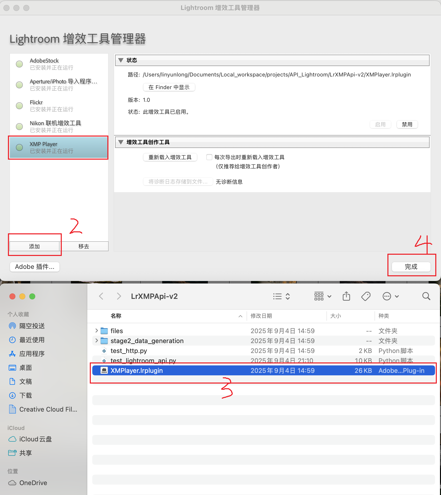

# Agent-to-Lightroom Protocol

A Python API client for communicating with Adobe Lightroom via a custom plugin, enabling automated photo processing through HTTP requests. Supports both local (file path) and remote (file upload) modes. **Now supports both Lua and XMP preset formats with automatic conversion.**

## Components

- **XMPlayer.lrplugin/**: Lightroom plugin that creates a socket server
- **lrc_api_server.py**: Python server that connects to the plugin and provides HTTP API
- **test_http.py**: Client for sending photo processing requests (supports both local and remote modes)
- **config/**: Configuration files in YAML format
- **utils/xmp2lua.py**: XMP to Lua converter for automatic preset conversion

## Quick Start

### 1. Install the Plugin to Lightroom Classic

#### Step 1: Access Plugin Manager
Open Lightroom Classic and navigate to the Plugin Manager:
- Click `File` → `Plug-in Manager...`



#### Step 2: Add the Plugin
In the Plugin Manager window:
- Click the `Add` button (添加)
- Browse and select the `XMPlayer.lrplugin/` directory from this project
- Click `Done` (完成) to complete the installation



The XMP Player plugin should now appear in your plugin list and be ready to use.

### 2. Run the Python API Server
```bash
python lrc_api_server.py
```

### 3. Configure Paths
Configure paths in `config/paths.yaml` according to your setup.

### 4. Send Photo Processing Requests
```bash
python test_http.py
```

## Configuration

The project uses YAML configuration files located in the `config/` directory:

### config/config.yaml
- Socket connection settings (host, port, timeouts)
- HTTP server settings
- Keepalive and buffer configurations
- Logging settings
- **File upload limits and allowed extensions**

### config/paths.yaml
- Example photo and preset paths
- Default directories
- Supported file formats

### Upload Configuration
- Max file size: 100MB per file
- Max total upload: 200MB
- Supported photo formats: .jpg, .jpeg, .dng, .cr2, .nef, .tiff, .tif, .raw, .arw
- Supported preset formats: .lua, .xmp

## XMP Preset Support

The system now supports XMP preset files in addition to Lua presets. When you provide an XMP file:

1. **Automatic Conversion**: The server automatically converts XMP files to Lua format using the `utils/xmp2lua.py` converter
2. **Transparent Operation**: No changes needed to your workflow - just provide the XMP file path or upload an XMP file
3. **Works in Both Modes**:
   - **Local mode**: Provide XMP file path in `lua_path` field, conversion happens automatically
   - **Remote mode**: Upload XMP file as `lua_file`, conversion happens on the server

### Example Usage with XMP

**Local mode (JSON request):**
```json
{
    "photo_path": "path/to/photo.dng",
    "lua_path": "path/to/preset.xmp"
}
```

**Remote mode (file upload):**
Upload your XMP file as `lua_file` parameter - the server will handle the conversion automatically.

The converted Lua file will be saved in the same directory as the XMP file (for local mode) or in the upload directory (for remote mode).
